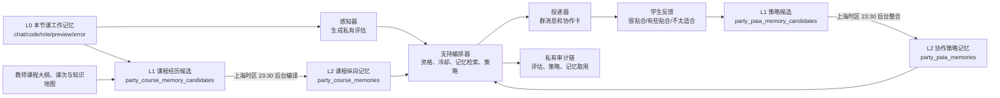

# 琳琳协作支持 Agent 架构

## 目标与边界

琳琳是结对编程小组的过程支持参与者。系统使用固定的基础模型，通过经过学生或教师反馈验证的外部记忆调整支持策略；这一过程不涉及训练或更新基础模型参数。

设计目标是让系统能够逐步支持共同目标、相互解释、角色协调、建设性调试、AI 建议核验与反思，同时保持三个边界：

- 学生只接收面向小组、友善且可执行的协作邀请，不接收个人诊断、证据摘要、置信度或被判定对象。
- 教师和研究用途可在授权界面查看最小必要的私有分析证据与决策链；这类信息不经群聊 WebSocket 或学生 API 返回。
- 任何可迁移记忆必须来自明确的人类反馈；原始聊天文本、学生画像和一次未验证的模型判断都不能直接成为跨情境规则。

## 分层架构



### 1. 协作事件账本

`party_learning_events` 是只追加的过程事实层。事件来自群聊、HTML/CSS 编辑、角色轮换、阶段切换、预览和诊断。每条事件须有房间、任务、阶段、时间、事件类型和最小元数据。它记录发生了什么，不直接做人格、能力或动机推断。

### 2. 感知器

感知器读取有限时间窗口的事件，产生私有 `assessment`：支持与否、置信度、证据引用、候选支持状态和模型版本。当前已接入的是近五分钟群聊参与度感知器；它保留 `participationStatus`、`reasonCodes` 和证据消息 ID，且只有达到服务器阈值才进入下一层。

后续感知器应独立新增，而不修改已有评估的语义：

- 共同目标：任务阶段改变后缺少对交付物的共同确认；
- 相互解释：快速同意或大量修改后未见理由说明；
- 建设性调试：连续错误、重复试错与缺少验证动作；
- AI 建议核验：AI 建议后出现直接采纳而缺少学生解释或预览验证；
- 反思：阶段完成后未形成可迁移的协作经验。

### 3. 支持编排器

编排器是唯一可以决定“是否向学生发送提示”的层。输入为私有评估、当前任务阶段、近期干预、权限状态和检索到的记忆，输出是可持久化的 `supportPlan`：

```js
{
  schemaVersion: 1,
  supportNeed: "role_coordination",
  strategyKey: "driver_navigator_check",
  memoryPolicy: "reuse_validated_strategy",
  shouldDeliver: true,
  skipReason: "",
  publicPrompt: "……",
  memoryIds: ["…"]
}
```

当前编排规则使用 `role_coordination` 与 `mutual_explanation` 两类支持状态，公开文本由稳定模板生成，避免模型把内部判断改写成指责性消息。以后可用受控的提示词生成器替换模板，但输出必须继续通过公开表达策略校验。

`LINLIN_COLLABORATION_SOUL` 表示稳定的教学角色、语气和公开表达规则。它是琳琳自身的版本化配置，与学生学习记忆分开存储。学生个人经历和能力判断使用独立、可查看、可纠正、可暂停、可过期的私有学习记忆。

### 4. 三层纵向学习—协作记忆

记忆更新遵循课堂周期，而不是在一次课堂中实时改写长期记忆：

- **L0 本节课工作记忆**：`party_learning_events` 和最近群聊保存原始过程、任务阶段与即时状态。本节课的感知和短期纠偏使用这一层。
- **L1 原子经历候选**：学生反馈实时写入 `party_paia_memory_candidates`；夜间编译器从过程事件生成 `party_course_memory_candidates`。候选保留课程、课次、作品、记忆主体、知识点、来源事件和置信度，课堂中不参与长期检索。
- **L2 跨课长期记忆**：后台在 `Asia/Shanghai` 每晚 23:30 后将策略候选合并到 `party_paia_memories`，并将课程经历候选整合到 `party_course_memories`。下一次课堂只能检索已经完成夜间整合的稳定记忆。

服务每十分钟检查一次到期候选，因此正常情况下会在 23:30 后完成；如果进程短暂重启，恢复后会自动补跑。学生在当天课堂中的“不太适合”仍可通过当前干预的 `feedbackAt` 产生十五分钟会话级冷却，但它不会直接成为长期记忆。

协作策略 L2 默认 90 天过期；课程纵向 L2 默认保留 730 天，以覆盖一个或两个学期并为课程结束后的研究审计留出时间。编排器会复用被确认贴合的策略，并避开被否定或仅部分贴合的具体策略。每次检索把 `strategyKey`、`memoryPolicy` 和记忆 ID 写入私有编排轨迹；新候选保存 `appliedMemoryIds`，可据此计算旧记忆应用后的反馈结果。

课程纵向记忆同时按两个维度组织：

| 主体 | 当前记忆类型 | 作用范围 |
| --- | --- | --- |
| `course` | `course_progress` | 连接教师大纲、课次和跨作品知识序列 |
| `project` | `project_snapshot` | 保存作品阶段、代码版本、知识点、预览和未解决诊断 |
| `pair` | `collaboration_pattern` | 保存特定搭档的讨论、修改、预览、交棒和行为均衡证据 |
| `student` | `learning_activity`、`knowledge_evidence`、`ability_judgment` | 保存有来源的活动、解释、代码贡献与能力判断；能力判断必须同时保留证据、置信度、时间范围和教师审核状态 |
| `agent` | `agent_outcome` | 汇总琳琳介入和学生反馈，具体策略效果仍由人类验证记忆维护 |

课程 ID 由授课范围、班级、学期和教师配置的课程标识组成，同一班级跨小教室共享。`roomId` 代表整个学期固定的两名学生及其长期搭档空间，是纵向记忆的主要查询和隔离边界。作品 ID 由房间和 `taskRevision` 组成；搭档 ID 由两名学生 ID 排序后哈希生成；学生记忆使用账户 ID，并在同一房间内跨作品持续积累。更换房间属于特殊管理操作，既有记忆默认不自动迁移。

教师后台的 `paiaCourseMemoryConfig` 是课程大纲和知识地图的权威来源，包括课程名称、学期、课程大纲、知识点、所属单元和前置关系。已有 `teacherCoursePlans` 继续提供班级、课次时间、任务与附件。夜间编译器把课堂证据连接到教师配置，不允许模型自动改写大纲。

默认知识地图覆盖 HTML 页面结构、语义化、链接与媒体、CSS 选择器与层叠、盒模型、Flexbox、Grid、视觉样式、响应式设计和调试验证。教师可以覆盖或扩展这些知识点。代码模式只能证明作品中出现了相关结构；学生级“知识证据”还区分有理由的对话与有署名的代码版本。系统可以形成“CSS 能力较弱”“合作能力需要支持”等能力判断，但判断必须由可回看的过程证据支持，缺少某类操作本身不能作为能力较弱的证据。

下一次 `@AI` 回答会组装一个有限的课程启动包：教师大纲、当前房间的作品快照、当前房间的旧作品、固定搭档记忆、两名学生相关知识证据、课程进展和琳琳策略记录。检索结果限制长度并按当前作品、搭档、学生、课程、Agent 排序，不把整个学期的原始对话塞入提示词。房间级主体不会检索其他房间的项目或学生记忆。

每条活动记忆保存 `retrievalEnabled`、`allowedUseTypes` 和 `publicDisclosure`。教师可暂停检索，分别控制记忆是否用于学生 `@AI` 回答和群聊主动提醒，并规定群聊中只转化为行动建议或允许概括判断。无论内部记忆内容如何，公开提醒继续通过琳琳的友善表达规则生成。

每次记忆参与学生回答或主动提醒，系统都写入 `party_memory_uses`，记录房间、任务、作品、记忆及版本、使用类型、检索原因、AI 任务、消息和干预 ID。使用后十五分钟内的学生聊天、代码修改、预览与反馈会关联为后续事件；学生对主动提醒的“贴合／部分贴合／不适合”反馈继续更新该次使用的结果。聚合 `useCount` 只用于快速统计，逐次记录才是研究审计和效果分析依据。

自动编译的课程记忆标记为 `system_observed`。教师可将其确认为 `human_confirmed`，也可修改判断文本、添加说明、暂停检索、限制使用场景、标记为 `human_rejected` 或直接删除；被拒绝的记忆不会进入 Agent 检索包。教师修改判断时追加版本记录，新的夜间证据不会静默覆盖教师的确认或拒绝状态。

`LINLIN_COLLABORATION_SOUL` 是琳琳稳定的教学角色配置，位于三层学习记忆之外，不由夜间任务自动改写。

同一房间的感知任务使用 Redis 运行锁串行执行。调度仍可每三十秒产生一次分析任务，但前一任务尚未结束时，后一任务会以 `room_analysis_already_running` 安静结束，避免两个模型任务基于同一窗口同时发送重复支架。夜间纵向记忆还使用集群级 Redis 锁，避免多个 worker 实例重复编译和累计同一批候选；候选本身具有稳定唯一键与 `pending/processing/consolidated` 状态，过期的处理租约可以恢复。

记忆扩展顺序固定为：房间级验证记忆 → 教师确认的班级策略记忆 → 跨班级的匿名化策略库。后两层需要单独的审核、撤回和权限界面，不能由单个学生反馈直接升级。

### 5. 投递与反馈

投递器只使用 `normalizePublicCollaborationIntervention` 输出下列公开字段：ID、支持状态、友善提示、反馈及时间。`evidenceSummary`、`targetUserId`、参与度分析、记忆 ID 和编排轨迹永不进入学生 WebSocket 或协作卡。

学生端反馈的语义改为“很贴合 / 有些贴合 / 这次不太适合”。它是对支持方式的校正，不要求学生接受系统对个人的判断。教师旁观者只能阅读公开协作提示；私有诊断应在下一阶段的教师研究视图中，以单独授权的接口提供。

一条干预只接受第一份完整反馈，防止另一名成员或重复请求覆盖已经形成的验证记录。同一学生提交完全相同内容的网络重试视为幂等请求，系统会继续补齐记忆写入而不重复记录反馈事件。

## 当前代码落点

| 架构层 | 当前实现 |
| --- | --- |
| 事件账本 | `server/modules/party-coding/learning-service.js` 的 `recordEvent` 与 `PartyLearningEvent` |
| 感知器 | `server/modules/party-coding/participation-analysis.js`，经 `GroupChatAiTask` 异步执行 |
| 编排器 | `server/modules/party-coding/collaboration-agent.js` |
| L1 候选与 L2 长期记忆 | `server/modules/party-coding/collaboration-memory.js`、`PartyCollaborationMemoryCandidate` 与 `PartyCollaborationMemory` |
| 课程大纲与纵向记忆 | `server/modules/party-coding/longitudinal-memory.js`、`PartyLongitudinalMemoryCandidate`、`PartyLongitudinalMemory` 与 `PartyMemoryCompilationState` |
| 逐次记忆使用 | `server/modules/party-coding/memory-usage.js` 与 `PartyMemoryUse`；学生后续过程事件和反馈会关联到本次使用 |
| 教师配置与审计 API | `GET/PATCH /api/auth/admin/collaboration-course-memory-config`、`GET /api/auth/admin/collaboration-classrooms/:roomId/memories`、证据 `GET .../:memoryId/evidence`、记忆 `PATCH/DELETE` |
| 投递 | `server/services/group-chat-ai-worker.js`、群聊消息与 `coding_collab_intervention` |
| 学生公开 UI | `src/pages/party-chat/desktop/WebCollabPanel.jsx` |
| 教师课程配置与治理 UI | `src/pages/TeacherHomePage.jsx` 的“课程大纲与记忆知识地图”，以及 `TeacherRoomMemoryDialog.jsx` 的房间记忆档案、证据回看、审核与使用控制 |

## 分阶段落实

1. **架构底座（已完成）**：稳定协作角色、支持状态、公开/私有数据边界、房间级人类验证策略记忆和现有参与度感知器。
2. **课程纵向记忆（已完成）**：教师大纲、课次定位、五类记忆主体、夜间课程编译、跨作品检索包、使用计数和教师审计接口。
3. **教师治理与使用审计（一期已完成）**：房间记忆档案、判断修改、确认、驳回、暂停、删除、证据回看、使用控制和逐次使用记录已经接入。候选逐条采纳与研究导出仍待后续补充。
4. **语义能力判断增强**：在当前确定性 HTML/CSS 检测之上增加受约束的夜间语义提取，使系统可以在充分证据下生成可审查的 `ability_judgment`；模型结论先进入候选层，经整合或教师确认后再参与检索。
5. **记忆策略评估**：运行无记忆、原始记录、人类验证结构化记忆等条件，对重复失配、跨作品迁移、校准、干预恰当性和负迁移进行比较。
